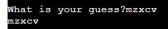
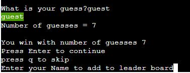

# Hacked Game

[Hacked Game](https://pp3-hacked-game-932b8166abb0.herokuapp.com/) is a Python Terminal Application that is intended to educate people on the importance of strong passwords
It is comprised of

- A password strength checking tool
- An option to check if the users password is on the most hacked password list of 2022 [Source](https://parade.com/living/most-common-passwords)
- A password guessing game that uses the list of most hacked passwords in 2022
- An option to create strong passwords (and check the password strength simultaneously)

## How to use:

1. Go to https://pp3-hacked-game-932b8166abb0.herokuapp.com/
2. Wait for application to load

### Password Strength Checker:

1. From the main menu enter option "1" and press Enter
2. Type out your password (this field does not display the password typed) and press Enter
   - The application will then output "At a rate of 100 guesses per hour your password would take {time} to crack"
   - Passwords will then be deleted from memory
3. Press Enter to return to the main menu

### Is your password on the Hacked Password List?

1. From the main menu enter option "2" and press Enter
2. Type out your password (this field does not display the password typed) and press Enter

   - The application will then output either

     - The password entered is on the list
     - With additional feedback to change password

       

   - The password entered is not on the list

     

3. Press Enter to return to the main menu

### Password Hacking Game:

1. From the main menu enter option "3" and press Enter
   - The menu will display 5 options
   - The game modes
   - View Leader Board
   - Exit to main menu
2. Enter the difficulty you wish the try:
   - "Easy"
   - "Difficult"
   - "Hard"
3. The game instructions will then print
4. Press Enter to continue to the game
5. The game will tell you the length of the password
6. Input your guess into the game and await feedback
7. Yellow feedback indicates that the characters are in the password but in the wrong location
   - 
8. White feedback indicates that the characters are not in the password
   - 
9. Green feedback (u in the bellow screenshot) indicates that the characters are in the password and the correct location
   - 
10. If you guessed all the characters in the correct location you will win the game
    - 
11. Enter your name to add your name to the leader-board, or select q to exit
12. If you get stuck you can enter help as an option to reveal the password character types
    - 

### Password Hacking Game Leader-board

1. From the main menu enter option "3" and press Enter
   - The menu will display 5 options
   - The game modes
   - View Leader Board
   - Exit to main menu
2. Input 4 and press enter
3. You will then need to decide on the difficulty leaderboard to view
   - 
4. The desired leader board table will print (sorted lowest guesses to highest)
   - 

### Password Generator

1. From the main menu enter option "4" and press Enter
2. Enter the length of the password greater than 1
   - 0 length passwords
   - Negative integer passwords
   - 1 length passwords will display an error
3. Copy the password from terminal
4. Press Enter to return to the main menu

Example Output:

- 

## Testing

### Manual Testing

MM = Main Menu
PS = Password Strength Checking Tool (option 1 main menu)
PL = Password List

<table>
<thead>
  <tr>
    <th>Testing Description</th>
    <th>Expected Action</th>
    <th>Actual Output</th>
    <th>Result</th>

  </tr>
</thead>
<tbody>
  <tr>
    <td>Main Menu Loads</td>
    <td>User is presented with menu</td>
    <td>User is presented with menu</td>
    <td>Confirmed</td>
  </tr>
  <tr>
    <td>MM Option 1</td>
    <td>User is presented with password strength checking tool</td>
    <td>User is presented with password strength checking tool</td>
    <td>Confirmed</td>
  </tr>
  <tr>
    <td>MM Option 2</td>
    <td>User is presented with checking password against password list</td>
    <td>User is presented with checking password against password list</td>
    <td>Confirmed</td>
  </tr>
  <tr>
    <td>MM Option 3</td>
    <td>User is presented with a game</td>
    <td>User is presented with a game</td>
    <td>Confirmed</td>
  </tr>
  <tr>
    <td>MM Option 4</td>
    <td>User can create a new password</td>
    <td>User can create a new password</td>
    <td>Confirmed</td>
  </tr>
  <tr>
    <td>MM Option Q</td>
    <td>Application ends</td>
    <td>Application ends</td>
    <td>Confirmed</td>
  </tr>
  <tr>
    <td>All other input</td>
    <td>Presents error and presents menu</td>
    <td>Presents error and presents menu</td>
    <td>Confirmed</td>
  </tr>
  <tr>
    <td>PS</td>
    <td>User inputs a correct password to verify </td>
    <td>Password is verified with time to crack</td>
    <td>Confirmed</td>
  </tr>
  <tr>
    <td>PS</td>
    <td>User inputs a 0 length password</td>
    <td>User is presented with error and asked to enter a correct password</td>
    <td>Confirmed</td>
  </tr>
  <tr>
    <td>PL</td>
    <td>User inputs a correct on the list</td>
    <td>User is informed password is on the list</td>
    <td>Confirmed</td>
  </tr>  
  <tr>
    <td>PL</td>
    <td>User inputs a password not on the list</td>
    <td>User is informed password is not on the list</td>
    <td>Confirmed</td>
  </tr>  
  <tr>
    <td>PL</td>
    <td>User inputs a 0 length password</td>
    <td>User is presented with error and asked to enter a correct password</td>
    <td>Confirmed</td>
  </tr>  
  <tr>
    <td>PG</td>
    <td>User is presented with Difficulty menu</td>
    <td>User is presented with Difficulty menu</td>
    <td>Confirmed</td>
  </tr>  
  <tr>
    <td>PG</td>
    <td>user inputs easy</td>
    <td>Easy mode loads</td>
    <td>Confirmed</td>
  </tr>  
  <tr>
    <td>PG</td>
    <td>user inputs difficult</td>
    <td>Difficult mode loads</td>
    <td>Confirmed</td>
  </tr>  
  <tr>
    <td>PG</td>
    <td>user inputs hard</td>
    <td>Hard mode loads</td>
    <td>Confirmed</td>
  </tr>  
  <tr>
    <td>PG</td>
    <td>user inputs 4</td>
    <td>user is presented with leader board options</td>
    <td>Confirmed</td>
  </tr>
  <tr>
    <td>PG Menu</td>
    <td>User inputs invalid option</td>
    <td>User presented with error and menu options</td>
    <td>Confirmed</td>
  </tr>  
  <tr>
    <td>PG leader board</td>
    <td>user inputs 1</td>
    <td>Easy Leader board is presented</td>
    <td>Confirmed</td>
  </tr>  
  <tr>
    <td>PG leader board</td>
    <td>user inputs 2</td>
    <td>Difficult Leader board is presented</td>
    <td>Confirmed</td>
  </tr>  
  <tr>
    <td>PG leader board</td>
    <td>user inputs 3</td>
    <td>Hard Leader board is presented</td>
    <td>Confirmed</td>
  </tr>   
  <tr>
    <td>PG leader board</td>
    <td>user inputs q</td>
    <td>User exists current menu</td>
    <td>Confirmed</td>
  </tr>
  <tr>
    <td>PG Easy</td>
    <td>User is presented with game instructions</td>
    <td>User is presented with game instructions</td>
    <td>Confirmed</td>
  </tr>  
  <tr>
    <td>PG Difficult</td>
    <td>User is presented with game instructions</td>
    <td>User is presented with game instructions</td>
    <td>Confirmed</td>
  </tr>  
  <tr>
    <td>PG Hard</td>
    <td>User is presented with game instructions</td>
    <td>User is presented with game instructions</td>
    <td>Confirmed</td>
  </tr>  
  <tr>
    <td>PG Easy</td>
    <td>User inputs guess q</td>
    <td>Game ends</td>
    <td>Confirmed</td>
  </tr>  
  <tr>
    <td>PG Difficult</td>
    <td>User inputs guess q</td>
    <td>Game ends</td>
    <td>Confirmed</td>
  </tr>  
  <tr>
    <td>PG Hard</td>
    <td>User inputs guess q</td>
    <td>Game ends</td>
    <td>Confirmed</td>
  </tr>  
  <tr>
    <td>PG Easy</td>
    <td>User inputs guess help</td>
    <td>User is presented with help options (as above)</td>
    <td>Confirmed</td>
  </tr>   
  <tr>
    <td>PG Difficult</td>
    <td>User inputs guess help</td>
    <td>User is presented with help options (as above)</td>
    <td>Confirmed</td>
  </tr>   
  <tr>
    <td>PG Hard</td>
    <td>User inputs guess help</td>
    <td>User is presented with help options (as above)</td>
    <td>Confirmed</td>
  </tr>   
  <tr>
    <td>PG Easy</td>
    <td>User inputs a guess too short</td>
    <td>Error to inform user of this appears</td>
    <td>Confirmed</td>
  </tr>  
  <tr>
    <td>PG Easy</td>
    <td>User inputs a guess too long</td>
    <td>Error to inform user of this appears</td>
    <td>Confirmed</td>
  </tr>  
  <tr>
    <td>PG Easy</td>
    <td>Guess is the correct length with incorrect characters</td>
    <td>Printed guess characters in default white</td>
    <td>Confirmed</td>
  </tr>  
  <tr>
    <td>PG Easy</td>
    <td>Guess is the correct length with correct letters in wrong place</td>
    <td>Printed guess characters in yellow</td>
    <td>Confirmed</td>
  </tr>  
  <tr>
    <td>PG Easy</td>
    <td>Guess is the correct length with correct letters in correct place</td>
    <td>Printed guess characters in green</td>
    <td>Confirmed</td>
  </tr>
  <tr>
    <td>PG Difficult</td>
    <td>User inputs a guess too short</td>
    <td>Error to inform user of this appears</td>
    <td>Confirmed</td>
  </tr>  
  <tr>
    <td>PG Difficult</td>
    <td>User inputs a guess too long</td>
    <td>Error to inform user of this appears</td>
    <td>Confirmed</td>
  </tr> 
  <tr>
    <td>PG Difficult</td>
    <td>Guess is the correct length with incorrect characters</td>
    <td>Printed guess characters in default white</td>
    <td>Confirmed</td>
  </tr>  
  <tr>
    <td>PG Difficult</td>
    <td>Guess is the correct length with correct letters in wrong place</td>
    <td>Printed guess characters in yellow</td>
    <td>Confirmed</td>
  </tr>  
  <tr>
    <td>PG Difficult</td>
    <td>Guess is the correct length with correct letters in correct place</td>
    <td>Printed guess characters in green</td>
    <td>Confirmed</td>
  </tr>
  <tr>
    <td>PG Hard</td>
    <td>User inputs a guess too short</td>
    <td>Error to inform user of this appears</td>
    <td>Confirmed</td>
  </tr>  
  <tr>
    <td>PG Hard</td>
    <td>User inputs a guess too long</td>
    <td>Error to inform user of this appears</td>
    <td>Confirmed</td>
  </tr> 
  <tr>
    <td>PG Hard</td>
    <td>Guess is the correct length with incorrect characters</td>
    <td>Printed guess characters in default white</td>
    <td>Confirmed</td>
  </tr>  
  <tr>
    <td>PG Hard</td>
    <td>Guess is the correct length with correct letters in wrong place</td>
    <td>Printed guess characters in yellow</td>
    <td>Confirmed</td>
  </tr>  
  <tr>
    <td>PG Hard</td>
    <td>Guess is the correct length with correct letters in correct place</td>
    <td>Printed guess characters in green</td>
    <td>Confirmed</td>
  </tr>
  <tr>
    <td>PG User wins Easy</td>
    <td>User has guessed the correct word</td>
    <td>Whole word appears in green</td>
    <td>Confirmed</td>
  </tr>  
  <tr>
    <td>PG User wins Difficult</td>
    <td>User has guessed the correct word</td>
    <td>Whole word appears in green</td>
    <td>Confirmed</td>
  </tr>  
  <tr>
    <td>PG User wins Hard</td>
    <td>User has guessed the correct word</td>
    <td>Whole word appears in green</td>
    <td>Confirmed</td>
  </tr>  
  <tr>
    <td>PG User Wins Easy</td>
    <td>User is asked to enter name</td>
    <td>User is asked to enter name</td>
    <td>Confirmed</td>
  </tr> 
    <tr>
    <td>PG User Wins Easy</td>
    <td>User enters a 0 length name</td>
    <td>Error message is displayed and asked for a name</td>
    <td>Confirmed</td>
  </tr>
  <tr>
    <td>PG User Wins Easy</td>
    <td>User enters q as name</td>
    <td>User returns to menu skipping leader board</td>
    <td>Confirmed</td>
  </tr>  
  <tr>
    <td>PG User Wins Easy</td>
    <td>User enters a legitimate name not already on list</td>
    <td>leader board is updated</td>
    <td>Confirmed</td>
  </tr>  
  <tr>
    <td>PG User Wins Easy</td>
    <td>User enters a legitimate name already on list</td>
    <td>error stating name is already on list appears and asked for a new name</td>
    <td>Confirmed</td>
  </tr>

<tr>
    <td>PG User Wins Difficult</td>
    <td>User is asked to enter name</td>
    <td>User is asked to enter name</td>
    <td>Confirmed</td>
  </tr> 
    <tr>
    <td>PG User Wins Difficult</td>
    <td>User enters a 0 length name</td>
    <td>Error message is displayed and asked for a name</td>
    <td>Confirmed</td>
  </tr>
  <tr>
    <td>PG User Wins Difficult</td>
    <td>User enters q as name</td>
    <td>User returns to menu skipping leader board</td>
    <td>Confirmed</td>
  </tr>  
  <tr>
    <td>PG User Wins Difficult</td>
    <td>User enters a legitimate name not already on list</td>
    <td>leader board is updated</td>
    <td>Confirmed</td>
  </tr>  
  <tr>
    <td>PG User Wins Difficult</td>
    <td>User enters a legitimate name already on list</td>
    <td>error stating name is already on list appears and asked for a new name</td>
    <td>Confirmed</td>
  </tr>  
<tr>
    <td>PG User Wins Hard</td>
    <td>User is asked to enter name</td>
    <td>User is asked to enter name</td>
    <td>Confirmed</td>
  </tr>  
  <tr>
    <td>PG User Wins Hard</td>
    <td>User enters q as name</td>
    <td>User returns to menu skipping leader board</td>
    <td>Confirmed</td>
  </tr>  
  <tr>
    <td>PG User Wins Hard</td>
    <td>User enters a legitimate name not already on list</td>
    <td>leader board is updated</td>
    <td>Confirmed</td>
  </tr>
  <tr>
    <td>PG User Wins Hard</td>
    <td>User enters a 0 length name</td>
    <td>Error message is displayed and asked for a name</td>
    <td>Confirmed</td>
  </tr>  
  <tr>
    <td>PG User Wins Hard</td>
    <td>User enters a legitimate name already on list</td>
    <td>error stating name is already on list appears and asked for a new name</td>
    <td>Confirmed</td>
  </tr>  
  <tr>
    <td>Password Generator</td>
    <td>User enters a positive integer between 2 and 40</td>
    <td>User is presented with password and password strength</td>
    <td>Confirmed</td>
  </tr>  
  <tr>
    <td>Password Generator</td>
    <td>User enters negative integer</td>
    <td>User is presented with error and instructions</td>
    <td>Confirmed</td>
  </tr>   
  <tr>
    <td>Password Generator</td>
    <td>User enters any number above 40</td>
    <td>User is presented with error and instructions</td>
    <td>Confirmed</td>
  </tr>
   <tr>
    <td>Password Generator</td>
    <td>User enters a 0 or 1 length password</td>
    <td>User is presented with error and instructions</td>
    <td>Confirmed</td>
</tbody>
</table>
